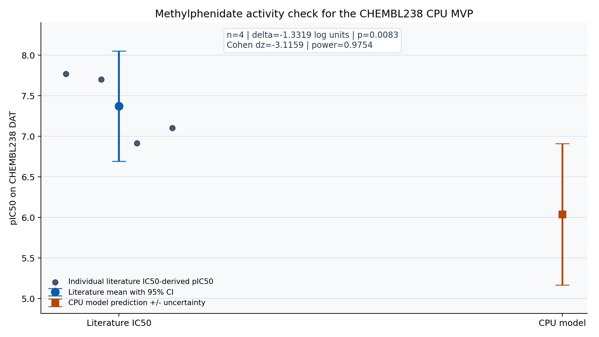

# Multi-Target pIC50 Predictor

[](https://opensource.org/licenses/MIT)
[](https://www.python.org/downloads/)
[](https://www.docker.com/)

A CPU-runnable drug-discovery MVP for target-specific pIC50 prediction,
compound triage, and early medicinal chemistry decision support. The current
pharma-facing path is deliberately narrow: fixed ChEMBL snapshots, scaffold and
external splits, uncertainty, applicability domain, and a FastAPI surface that a
sponsor or reviewer can test without GPU access.

The project started as a DAT activity predictor and now demonstrates a modular
discovery pipeline for:

- multi-target pIC50 and pKi modeling across DAT, 5-HT2A, CB1, CB2, and opioid receptors
- RDKit descriptors, ECFP4/MACCS fingerprints, SMARTS flags, and graph features
- elastic-looped Transformer regression as a third deep-learning path after
  descriptor Transformer and GNN baselines
- ETKDG 3D conformer generation with geometry descriptors
- ADMET and developability triage
- synthetic accessibility scoring with SA score and SCScore-style proxies
- retrosynthesis and forward-reaction baseline planning
- molecule image features for multimodal image + structure experiments
- optional Prefect/Airflow-style automation hooks
- future AlphaFold3 and docking simulation integration contracts

This code is intended for research and prioritization. It is not a clinical,
regulatory, or manufacturing decision system.

## AI Engineering Evidence Card

| Field | Current public evidence |
| --- | --- |
| Model surface | Transformer pIC50 workflow, optional GNN adapters, elastic-looped Transformer path, ensemble hooks, uncertainty reporting, and no-model compound assessment paths |
| Dataset surface | ChEMBL-backed pIC50/pKi target activity workflows for DAT, 5-HT2A, CB1, CB2, and opioid receptors, plus SMILES file triage inputs |
| Feature engineering | RDKit descriptors, ECFP4/MACCS fingerprints, SMARTS flags, ETKDGv3 3D descriptors, graph features, ADMET proxies, and synthetic accessibility scoring |
| Repro command | `uv sync` then `uv run python cli.py train --target CHEMBL238 --optimize` and `uv run python cli.py assess --smiles "CCN(CC)CC"` |
| Metrics to inspect | Unit/integration tests cover model, pipeline, discovery extension, and structure integration contracts; promote benchmark tables here when a calibrated public run is available |
| Limitations | Research triage only; pIC50/pKi, ADMET, docking, and synthesis outputs require calibration and expert review before real-world decisions |

## Third Deep-Learning Path: ELT

The CPU Ridge result on methylphenidate is directionally useful but weak by about
1.33 log units versus literature. A natural next model to try is ELT, based on
`zapabob/elastic-looped-transformer`: a Transformer block is shared across a
selectable number of loop iterations, so the same checkpoint can trade latency
for iterative refinement. In this repo, the idea is adapted from causal language
modeling to pIC50 regression over molecular descriptor tokens.

Current implementation:

- `src/models/elastic_looped_transformer.py` adds `ElasticLoopedPIC50Model` and
  `LitElasticLoopedPIC50`.
- `MultimodalElasticLoopedPIC50Model` extends that path with ViT-style molecule
  image patches plus descriptor tokens, leaving room for graph summary tokens.
- `train-elt` exposes the model from the CLI.
- `deep-cv` compares compact GNN and multimodal ELT runs on the same stable
  scaffold folds.
- The same checkpoint can be evaluated with shorter or longer loop schedules,
  making it a practical candidate for uncertainty and budget-sensitive pharma
  triage.

```bash
uv run python -B cli.py train-elt --target CHEMBL238 --loop-count 4 --epochs 20
```

CHEMBL238 CPU smoke run on the frozen snapshot:

```bash
uv run python -B scripts/run_elt_chembl238_smoke.py
```

The checked smoke report is
`artifacts/elt_chembl238_smoke_report.json`. In the 5-epoch CPU run, the ELT
path is not yet globally stronger than Ridge (`external R2 = -0.0213`, `RMSE =
1.1566`), but the methylphenidate loop trajectory is useful: pIC50 moves from
4.7812 at `L=1` to 6.3530 at `L=4`. That is still 1.0189 log units weaker than
the literature mean, but it is about 0.3130 pIC50 closer than the Ridge baseline
and roughly halves the methylphenidate fold error from about 21x to about 10x.

Reference implementation: https://github.com/zapabob/elastic-looped-transformer

Multimodal ELT/GNN cross-validation smoke run:

```bash
uv run python -B cli.py deep-cv --folds 3 --epochs 2 --max-rows 240
```

The checked report is `artifacts/deep_cv_chembl238_report.json`. This run uses
the frozen CHEMBL238 snapshot, holds external rows out of CV, and evaluates 240
CPU-sampled non-external rows with stable scaffold-hash folds. It is still a
small smoke comparison, not a production benchmark: multimodal ELT averaged
`R2 = -0.0342`, `RMSE = 1.1735`, `MAE = 0.9881`, `MSE loss = 1.3785`, while
compact GNN averaged `R2 = -0.1055`, `RMSE = 1.2146`, `MAE = 1.0161`,
`MSE loss = 1.4854`. The value is that the same
fold policy now compares graph and ViT-style looped-Transformer candidates.

Category-expanded scaffold CV run:

```bash
uv run python -B cli.py build-chembl-snapshot --targets CHEMBL224,CHEMBL218,CHEMBL253,CHEMBL233,CHEMBL236,CHEMBL238 --output data/chembl_category_pic50_snapshot.csv --manifest artifacts/chembl_category_pic50_snapshot.manifest.json --max-rows-per-target 300
uv run python -B cli.py deep-cv --snapshot data/chembl_category_pic50_snapshot.csv --output artifacts/deep_cv_category_report.json --target ALL --folds 3 --epochs 2 --max-rows 0
```

This expands the CV evidence to psychedelic (`CHEMBL224`), cannabinoid
(`CHEMBL218`, `CHEMBL253`), opioid (`CHEMBL233`, `CHEMBL236`), and
phenethylamine-like structure labels. The checked category report uses 1,800
ChEMBL rows, excludes 262 external rows from CV, and evaluates 1,538 rows with
stable scaffold folds.

| Model | Scope | n | R2 | RMSE | MAE | MSE loss |
| --- | --- | ---: | ---: | ---: | ---: | ---: |
| multimodal ELT | overall | 1,538 | 0.1413 | 1.2627 | 1.0510 | 1.5952 |
| GNN | overall | 1,538 | 0.0118 | 1.3560 | 1.1249 | 1.8410 |
| multimodal ELT | psychedelic | 272 | -0.5130 | 1.2497 | 0.9878 | 1.5616 |
| GNN | psychedelic | 272 | -0.5412 | 1.2612 | 1.0163 | 1.5907 |
| multimodal ELT | cannabinoid | 488 | 0.1243 | 1.3665 | 1.1450 | 1.8672 |
| GNN | cannabinoid | 488 | 0.0032 | 1.4579 | 1.2177 | 2.1256 |
| multimodal ELT | opioid | 519 | 0.0141 | 1.2454 | 1.0875 | 1.5511 |
| GNN | opioid | 519 | -0.1291 | 1.3328 | 1.1560 | 1.7764 |
| multimodal ELT | phenethylamine | 1,066 | 0.1576 | 1.3040 | 1.1024 | 1.7005 |
| GNN | phenethylamine | 1,066 | 0.0022 | 1.4193 | 1.1932 | 2.0143 |

The opioid slice includes checked mu-opioid (`CHEMBL233`) and delta-opioid
(`CHEMBL236`) rows. Kappa-opioid (`CHEMBL237`) remains mapped in code, but the
local ChEMBL fetch timed out before producing a checked snapshot.

## Pharma MVP Evidence Snapshot

This README is written for four reviewers at once:

| Audience | What to inspect | Why it matters |
| --- | --- | --- |
| Pharma R&D / translational science | Fixed CHEMBL238 snapshot, methylphenidate literature check, target-level R2/RMSE/MAE, context of use | Shows the model is framed as research-use decision support, with evidence separated from regulatory claims |
| MLOps | Dataset manifest, split policy, checksum, JSON model artifact, CPU reproducibility, `/health` endpoint | Makes data lineage, reproducibility, deployment shape, and lifecycle hooks visible |
| LLMOps | Structured API outputs, model version, uncertainty, applicability-domain status, research-only language | Lets an LLM copilot quote bounded evidence instead of inventing model confidence or use claims |
| AI engineering | RDKit descriptors, scikit-learn CPU baseline, FastAPI, tests, Docker CPU service | Gives a small but complete reference path from data to model to service |

Current CHEMBL238 CPU benchmark:

| Split | n | R2 | RMSE | MAE |
| --- | ---: | ---: | ---: | ---: |
| train | 1,762 | 0.2450 | 1.0474 | 0.8553 |
| scaffold_test | 359 | 0.3263 | 0.8699 | 0.7090 |
| external | 261 | 0.2062 | 1.0197 | 0.8295 |

Methylphenidate activity check against CHEMBL238 DAT literature values:



| Statistic | Value |
| --- | --- |
| Literature IC50 values | 17.0, 19.9, 79.0, 121.7 nM |
| Literature pIC50 mean | 7.3719 |
| Literature pIC50 95% CI | 6.6917 to 8.0521 |
| Geometric mean IC50 | 42.4673 nM |
| CPU model prediction | pIC50 6.0400, IC50 912.0108 nM |
| Model uncertainty / applicability domain | 0.8700, in-domain |
| Model minus literature mean | -1.3319 log units |
| One-sample t-test vs literature mean | t(3) = -6.2317, two-sided p = 0.008333 |
| Effect size | Cohen dz = -3.1159 |
| Observed power | 0.9754 at alpha = 0.05, two-sided |
| Inactive-rule result | 0 methylphenidate rows marked inactive under IQL / qualitative inactive or >=1000 uM rule |

Interpretation: methylphenidate is literature-active on CHEMBL238, while the
small CPU Ridge baseline underpredicts potency by about 1.33 log units. That is
useful MVP evidence because it exposes the full evaluation loop, not because it
claims production-grade accuracy. The next pharma evaluation step is a governed
multi-target ChEMBL or sponsor snapshot with locked data lineage, stronger
models, calibration, drift monitoring, and lifecycle change control.

Endpoint-aware psychopharmacology standard panel:

```bash
uv run python -B cli.py psychopharm-check
```

The standard panel now separates `IC50 -> pIC50`, `Ki -> pKi`, and keeps
`EC50 -> pEC50` as literature-only context instead of pooling all rows into a
single potency mean. The reference file covers 10 compounds: LSD, bkMDMA
(methylone), MDMA, Adderall as a d-amphetamine proxy, methylphenidate, morphine,
tramadol, delta-9-THC, CBD, and CBN. The JSON report includes per-endpoint n,
mean, median, SD, SEM, ChEMBL document IDs, DOI/PubMed IDs, RDKit descriptor
features, endpoint predictions, uncertainty, and applicability-domain status.

The checked endpoint ChEMBL training snapshot has 2,103 rows. It is deliberately
small enough for CPU runs, but still keeps endpoint and scaffold/external split
lineage visible through
`artifacts/chembl_endpoint_activity_snapshot.manifest.json`.

| Endpoint | Target | Train n | Scaffold R2 | Scaffold RMSE | External R2 | External RMSE |
| --- | --- | ---: | ---: | ---: | ---: | ---: |
| pIC50 | CB1 (CHEMBL218) | 157 | 0.3335 | 0.8558 | 0.4064 | 0.4242 |
| pIC50 | 5HT2A (CHEMBL224) | 169 | 0.2938 | 1.2142 | 0.1282 | 1.1508 |
| pIC50 | mu-opioid (CHEMBL233) | 147 | 0.2784 | 1.0827 | -0.1845 | 1.0193 |
| pIC50 | delta-opioid (CHEMBL236) | 144 | 0.3506 | 1.2635 | 0.0536 | 1.2991 |
| pIC50 | DAT (CHEMBL238) | 100 | -0.3838 | 1.0344 | 0.0796 | 0.9879 |
| pIC50 | CB2 (CHEMBL253) | 148 | -0.1090 | 1.2118 | -0.0165 | 0.6824 |
| pKi | CB1 (CHEMBL218) | 117 | 0.3322 | 0.9891 | -0.4526 | 1.0583 |
| pKi | 5HT2A (CHEMBL224) | 120 | 0.2592 | 0.9822 | -0.5980 | 1.0443 |
| pKi | mu-opioid (CHEMBL233) | 157 | -0.0086 | 1.3639 | -0.1398 | 1.2508 |
| pKi | delta-opioid (CHEMBL236) | 130 | -1.6863 | 1.8044 | -0.3634 | 1.7561 |
| pKi | DAT (CHEMBL238) | 109 | 0.0559 | 1.0929 | 0.3718 | 1.0212 |
| pKi | CB2 (CHEMBL253) | 131 | 0.2822 | 0.8283 | -0.7024 | 1.0760 |

Standard-panel prediction check:

| Compound | Target | Lit pIC50 mean | Pred pIC50 | Delta pIC50 | Lit pKi mean | Pred pKi | Delta pKi | Domain pIC50 / pKi |
| --- | --- | ---: | ---: | ---: | ---: | ---: | ---: | --- |
| Adderall / d-amphetamine | DAT | 6.5400 | 7.5960 | 1.0560 | 6.9600 | 6.4620 | -0.4980 | out / out |
| CBD / Cannabidiol | CB1 | 5.4200 | 5.5680 | 0.1480 | 5.6067 | 8.2240 | 2.6173 | out / in |
| CBD / Cannabidiol | CB2 |  | 8.2550 |  | 5.6567 | 8.5450 | 2.8883 | out / in |
| CBN / Cannabinol | CB1 |  | 5.8190 |  | 7.1333 | 7.3900 | 0.2567 | out / in |
| CBN / Cannabinol | CB2 |  | 7.3560 |  | 7.2400 | 7.4960 | 0.2560 | out / in |
| delta-9-THC / Dronabinol | CB1 | 8.5500 | 5.8190 | -2.7310 | 7.8480 | 7.9410 | 0.0930 | out / in |
| delta-9-THC / Dronabinol | CB2 |  | 8.7800 |  | 7.6800 | 8.6080 | 0.9280 | out / in |
| LSD / Lysergide | 5HT2A |  | 7.3450 |  | 8.4920 | 6.8160 | -1.6760 | out / out |
| MDMA / Midomafetamine | DAT | 5.7300 | 7.5300 | 1.8000 | 6.0500 | 6.7300 | 0.6800 | in / out |
| Methylphenidate / Methylphenidate | DAT | 7.4350 | 7.2420 | -0.1930 | 7.2150 | 6.5590 | -0.6560 | in / out |
| Morphine / Morphine | mu-opioid |  | 7.5160 |  | 8.6300 | 7.2600 | -1.3700 | in / in |
| Morphine / Morphine | delta-opioid |  | 7.5510 |  | 6.6850 | 6.9630 | 0.2780 | in / out |
| Tramadol / Tramadol | mu-opioid | 5.1200 | 6.8910 | 1.7710 | 5.7500 | 7.1660 | 1.4160 | in / in |
| Tramadol / Tramadol | delta-opioid |  | 7.6360 |  | 8.0300 | 7.6900 | -0.3400 | out / out |
| bkMDMA / methylone | DAT |  | 6.8790 |  |  | 6.6830 |  | in / out |

This is portfolio-grade evidence, not a validated QSAR claim. It is useful
because it shows endpoint separation, chemical-family coverage, descriptor-level
applicability-domain reporting, and honest weak spots before an LLM or reviewer
quotes the result.

The graph and README statistics are regenerated from local JSON evidence:

```bash
uv run python -B scripts/build_pharma_mvp_readme_assets.py
```

## Repository Layout

```text
.
|-- cli.py                         # Command-line entry point
|-- dat_predictor.py               # Legacy DAT predictor and GUI logic
|-- pyproject.toml                 # UV-managed project dependencies
|-- uv.lock                        # Reproducible dependency lockfile
|-- src/
|   |-- admet/                     # ADMET and developability profiling
|   |-- active_learning/           # Compound selection helpers
|   |-- data/                      # ChEMBL loading and dataset splitting
|   |-- features/                  # Molecular, graph, and 3D featurizers
|   |-- integrations/              # AlphaFold3 and docking job contracts
|   |-- models/                    # Transformer, GNN, ensemble, geometry GNNs
|   |-- multimodal/                # Molecule image feature extraction
|   |-- pipeline/                  # Integrated compound assessment workflows
|   |-- reactions/                 # Retro/forward reaction planning baseline
|   `-- synthesis/                 # Synthetic accessibility scoring
|-- tests/                         # Unit and integration tests
|-- docs/                          # Design and environment notes
`-- scripts/                       # Environment smoke checks and utilities
```

## Installation with UV

UV is the preferred environment manager for this repository.

```bash
uv sync
```

The default environment installs the core scientific stack:

- RDKit
- NumPy, pandas, SciPy, scikit-learn
- PyTorch
- pytest and development tools
- pIC50, ADMET, 3D conformer, synthesis, and image-feature dependencies

Optional extras are available for heavier workflows:

```bash
# Prefect orchestration
uv sync --extra workflow

# PyTorch Geometric model adapters
uv sync --extra gnn

# Protein structure and docking file helpers
uv sync --extra structure

# GUI dependencies
uv sync --extra gui

# API and production runtime dependencies
uv sync --extra prod
```

Airflow is intentionally managed separately because it should be installed with
the official Airflow constraints file:

```bash
uv pip install "apache-airflow==3.2.1" --constraint "https://raw.githubusercontent.com/apache/airflow/constraints-3.2.1/constraints-3.12.txt"
```

See [docs/uv_environment.md](docs/uv_environment.md) for more details.

## Quick Start

### CPU-Only Pharma MVP Demo

The repository includes a small CPU-only demo model for portfolio and stakeholder
walkthroughs. It uses a fixed descriptor benchmark, a scikit-learn Ridge model,
and checked-in JSON artifacts, so it does not require CUDA or a GPU.

Build or refresh the demo artifacts:

```bash
uv run python -B scripts/build_demo_cpu_model.py
```

Run a CPU-only prediction:

```bash
uv run python -B cli.py predict \
  --model models/demo_cpu_pic50_model.json \
  --target CHEMBL238 \
  --smiles "CC(=O)OC1=CC=CC=C1C(=O)O" \
  --uncertainty
```

Start the FastAPI demo service:

```bash
uv run uvicorn src.api.app:app --host 127.0.0.1 --port 8000
```

Available endpoints:

- `GET /health`
- `POST /predict`
- `POST /assess`

When `PIC50_MODEL_PATH=models/chembl_endpoint_cpu_model.json`, `/predict`
accepts `{"endpoints": ["pIC50", "pKi"]}` and returns endpoint-keyed
predictions with uncertainty and applicability-domain payloads.

The CPU demo is intentionally scoped as research triage and portfolio evidence.
It is not a clinical, regulatory, manufacturing, or patient-care decision
system. Replace `data/demo_pic50_benchmark.csv` with a governed ChEMBL or sponsor
snapshot before using the benchmark for scientific claims.

Freeze a ChEMBL pIC50 evaluation snapshot for a more serious pharma review:

```bash
uv run python -B cli.py build-chembl-snapshot \
  --targets CHEMBL238,CHEMBL224 \
  --output data/chembl_pic50_snapshot.csv \
  --manifest artifacts/chembl_pic50_snapshot.manifest.json
```

The snapshot command writes a CSV plus a JSON manifest containing filters, split
policy, per-target counts, and a SHA-256 checksum. Large generated ChEMBL
snapshots are local evaluation artifacts by default; the small endpoint MVP
snapshot is explicitly whitelisted for review reproducibility.

Build the endpoint-aware pIC50/pKi snapshot and CPU model used for the standard
psychopharmacology panel:

```bash
uv run python -B cli.py build-chembl-endpoint-snapshot \
  --targets CHEMBL238,CHEMBL224,CHEMBL218,CHEMBL253,CHEMBL233,CHEMBL236 \
  --endpoints pIC50,pKi \
  --output data/chembl_endpoint_activity_snapshot.csv \
  --manifest artifacts/chembl_endpoint_activity_snapshot.manifest.json \
  --max-rows-per-target-endpoint 200

uv run python -B cli.py build-endpoint-cpu-model \
  --dataset data/chembl_endpoint_activity_snapshot.csv \
  --output models/chembl_endpoint_cpu_model.json \
  --report artifacts/chembl_endpoint_cpu_benchmark.json
```

Predict both endpoints for an input SMILES:

```bash
uv run python -B cli.py predict \
  --model models/chembl_endpoint_cpu_model.json \
  --target CHEMBL238 \
  --endpoints pIC50,pKi \
  --smiles "COC(=O)C(c1ccccc1)C1CCCCN1" \
  --uncertainty
```

Run a no-model compound assessment. This produces ADMET and synthesis outputs,
and can optionally include 3D, reaction, and image features.

```bash
uv run python cli.py assess --smiles "CC(=O)OC1=CC=CC=C1C(=O)O"
```

Write the assessment to JSON:

```bash
uv run python cli.py assess \
  --smiles "CC(=O)OC1=CC=CC=C1C(=O)O" \
  --output artifacts/assessment.json
```

Assess a file of SMILES strings:

```bash
uv run python cli.py assess --input compounds.smi --output artifacts/assessment.csv
```

Include rendered image features:

```bash
uv run python cli.py assess \
  --input compounds.smi \
  --include-image \
  --output artifacts/multimodal_assessment.json
```

Use a trained pIC50 model when available:

```bash
uv run python cli.py assess \
  --model models/dat_transformer_model.pt \
  --target CHEMBL238 \
  --smiles "CCN(CC)CC"
```

## Core Workflows

### pIC50 Prediction

The existing pIC50 workflow supports ChEMBL-based target data retrieval,
feature calculation, Transformer training, and prediction with optional
uncertainty reporting.

```bash
uv run python cli.py train --target CHEMBL238 --optimize
uv run python cli.py predict --model models/dat_transformer_model.pt --smiles "CCN(CC)CC"
```

Supported target examples:

| Target | ChEMBL ID | Description |
| --- | --- | --- |
| DAT | CHEMBL238 | Dopamine transporter |
| 5-HT2A | CHEMBL224 | Serotonin 2A receptor |
| CB1 | CHEMBL218 | Cannabinoid receptor 1 |
| CB2 | CHEMBL253 / CHEMBL1861 | Cannabinoid receptor 2 |
| mu opioid | CHEMBL233 | Mu opioid receptor |
| delta opioid | CHEMBL236 | Delta opioid receptor |
| kappa opioid | CHEMBL237 | Kappa opioid receptor |

### 3D Structure Features

`src/features/structure3d.py` generates RDKit ETKDGv3 conformers, optimizes
them with MMFF or UFF, and returns 3D descriptors such as radius of gyration,
asphericity, eccentricity, principal moments of inertia, and spherocity index.

These descriptors are available through the integrated `assess` command.

### Geometry-Aware GNNs

`src/models/geometry_gnn.py` defines a factory adapter for SchNet and DimeNet++.
Install the GNN extra before using these models:

```bash
uv sync --extra gnn
```

Some PyTorch Geometric operations may require compiled extensions such as
`torch-scatter` or `torch-sparse`. On Windows, install those from the PyG wheel
index that matches your local Torch and CUDA build.

### ADMET Integration

`src/admet/predictor.py` provides a lightweight rule-based ADMET profile using
RDKit descriptors:

- molecular weight
- LogP
- TPSA
- HBD/HBA
- rotatable bonds
- formal charge
- QED
- permeability and solubility proxies
- developability proxy score

This is a triage layer. Replace or ensemble it with calibrated ADMET models for
production-grade prediction.

### Synthetic Accessibility

`src/synthesis/scores.py` provides:

- SA score proxy
- SCScore-style proxy
- synthetic feasibility score
- complexity drivers such as stereocenters, ring count, graph complexity,
  spiro atoms, bridgehead atoms, and flexibility

Use these outputs to rank compounds before synthesis planning or docking.

### Reaction Route Prediction

`src/reactions/planner.py` provides a conservative baseline interface for:

- retrosynthetic template disconnections
- forward reaction templates
- route serialization through `ReactionRoute` and `ReactionStep`

The current templates are intentionally simple. The interface is ready for
AiZynthFinder, ASKCOS, IBM RXN, or an in-house reaction transformer.

### Multimodal Features

`src/multimodal/image_featurizer.py` renders molecule images with RDKit and
converts them into compact image-derived features. These can be combined with
graph, descriptor, or 3D features for image + structure experiments.

### Automation

`src/pipeline/workflows.py` includes:

- batch assessment runner
- JSON/CSV result writing
- optional Prefect flow factory
- optional Airflow DAG factory

Run Prefect workflows after installing:

```bash
uv sync --extra workflow
```

## AlphaFold3 and Docking Integration

`src/integrations/structure_pipeline.py` defines project-level contracts for:

- protein target metadata
- local AlphaFold3-style protein-ligand JSON payloads
- docking job specifications
- command-line docking runners

The AlphaFold3 contract exports payloads containing `sequences`, ligand SMILES,
`modelSeeds`, `dialect`, and `version`. AlphaFold Server has non-commercial and
ligand restrictions, so this project keeps the integration focused on local or
managed AlphaFold3 deployments.

Docking support is intentionally backend-neutral. The current runner can build
command lines for tools such as Vina, Gnina, or site-specific docking wrappers.

## Validation

Run the environment smoke check:

```bash
uv run python -B scripts/smoke_uv_env.py
```

Run the discovery extension tests:

```bash
uv run python -B -m pytest tests/test_discovery_extensions.py tests/test_structure_integration_contracts.py -q
```

Run Ruff checks:

```bash
uv run ruff check . --preview
uv run ruff format . --check
```

The current codebase still contains legacy Ruff issues outside the newly added
discovery modules. Treat a full-project Ruff cleanup as a separate refactoring
task.

## Pharma MVP Readiness

The current repo is suitable as a portfolio-grade pharma MVP, not as a validated
QSAR product. It has the minimum pieces a serious reviewer expects to see:

- Clear context of use: research triage and decision support only; not clinical,
  regulatory, manufacturing, or patient-care decision-making.
- Fixed data path: demo fixture plus a CHEMBL238 ChEMBL snapshot with manifest,
  split policy, row counts, and checksum.
- Risk-based performance report: target-level R2, RMSE, and MAE for train,
  scaffold-test, and external splits.
- Statistical sanity checks: methylphenidate literature IC50 comparison with
  error bars, p-value, effect size, and observed power, plus a pIC50/pKi
  standard-panel report for 10 psychopharmacology reference compounds.
- Applicability domain and uncertainty: every CPU prediction returns domain
  status and uncertainty for review-time triage.
- API contract: `/health`, `/predict`, and `/assess` expose model status,
  prediction, and compound assessment through FastAPI.
- MLOps shape: JSON model artifact, benchmark JSON, reproducible CLI commands,
  Docker CPU service, tests, and explicit residual risks.
- LLMOps shape: structured model outputs and bounded research-use language make
  the service safer to wrap with an LLM assistant or report generator.

What this MVP proves:

- The evidence loop is implemented end to end on CPU.
- The evaluation is honest about scaffold/external generalization.
- A known active compound can be compared to literature with statistical
  outputs rather than a single anecdotal prediction.
- Model limitations are visible: the current CPU baseline underpredicts
  methylphenidate, so the demo invites model improvement instead of hiding it.

What remains before pharma-grade technical diligence:

- Governed ChEMBL or sponsor snapshot with frozen version, license review, and
  data-quality gates.
- Stronger baselines and calibrated uncertainty across multiple target families.
- External validation by target and chemical series, including assay-protocol
  stratification.
- Model registry, approval workflow, drift monitoring, rollback, audit logging,
  and lifecycle management.
- Mechanistic interpretation where feasible, aligned with QSAR validation
  expectations.

See [docs/pharma_mvp_cpu_demo.md](docs/pharma_mvp_cpu_demo.md) for the model
card-style details, regulatory alignment notes, and CPU deployment commands.

## Docker Production Stack

The production compose stack includes:

- application service
- PostgreSQL
- Redis
- Ollama for TxGemma
- Nginx
- Prometheus
- Grafana

Typical production deployment:

```bash
cp .env.example .env
cp config/config.yaml.example config/config.yaml
./scripts/deploy.sh production deploy
```

Service defaults:

- application: `http://localhost:8000`
- Grafana: `http://localhost:3000`
- Prometheus: `http://localhost:9090`

## Research Notes

- Use scaffold splits when evaluating medicinal chemistry generalization.
- Keep pIC50, ADMET, synthesis, docking, and AlphaFold-derived evidence
  separate until you have calibration data for combined ranking.
- Track uncertainty and applicability domain for every prediction.
- Validate reaction routes with a chemist and a dedicated retrosynthesis engine
  before synthesis decisions.
- Treat docking and AlphaFold3 outputs as structural hypotheses, not binding
  truth.

## License

This project is licensed under the MIT License.
